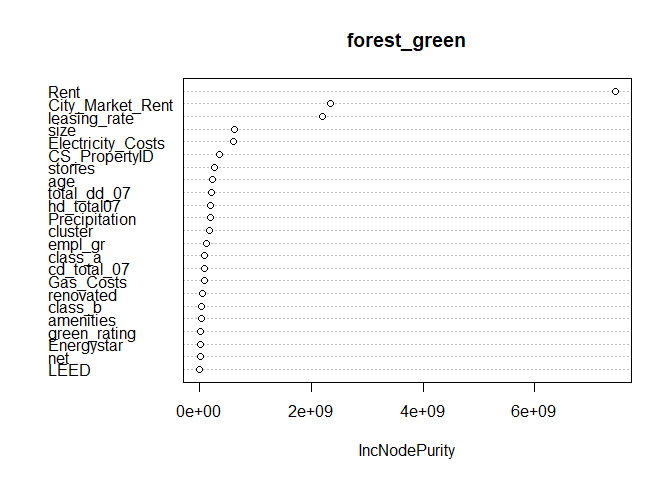
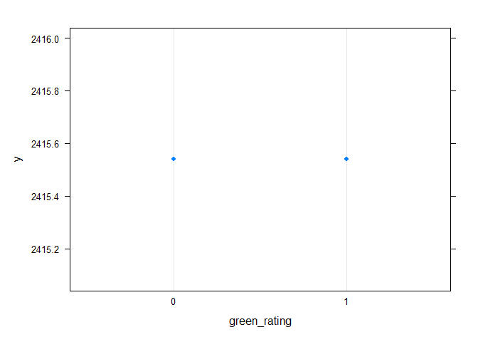

Problem 3 Predictive Modelling- Green Certification

I tried out four different machine learning models to see which one
would make the best predictions. Three of them were random forests and
the other one was a gradient boosting model.

    ## Distribution not specified, assuming gaussian ...

    ##   RFM1_rmse RFM2_rmse RFM3_rmse Boost_rmse
    ## 1    170.22  148.5256  187.5074   108.6954

Now I’m going to see how the green rating changes based on the optimal
machine learning model that I found earlier. I’m going to do this by
checking the partial dependence of the green rating. This means I’ll
look at how the green rating changes when I change other variables in
the model.

    ##   green_rating     yhat
    ## 1            0 2415.539
    ## 2            1 2415.539

The goal of this exercise is to figure out how much money commercial
rental properties make per square foot each year, and whether having a
green certification helps them make more money. To do this, I have
mutated a new column to calculate the revenue per square foot per
calender year based on the original data. I also made sure that some of
the variables were dummy variables. Then, I split the data into two
parts: one to train the computer on how to predict revenue, and another
to test how well it did. I used a machine learning technique called
random forest to make the prediction. The first model used all the
variables, and then I checked which ones were most important so I could
make other models and compare them. I wanted to see which model would
give the most accurate predictions.

Based on the importance of the variables in the first model, I made two
more models to see which one would give the best predictions. Even
though the green rating wasn’t very important in the model, I still
included it to check the real effect using a special algorithm.The
second model used 9 variables with different levels of importance, while
the third model used 12 variables, including some that were not very
important. I also checked the RMSE for each model and compared them to
the first model. The second model had a slightly lower RMSE than the
first model, which is good, but we want to find the best possible model.
So, I tried a different type of machine learning called gradient
boosting, using the same variables as the second model. I want to see if
this will give even better predictions.

So, I tried different shrinkage rates to see which one works best to
predict revenue for rental properties, and found that the gradient
boosting model works better than the random forest models.I was able to
make a model that is better than the 2nd model by reducing the error
rate to 108, while the best random forest model had an error rate of
148. In other words, my new model is better at predicting the revenue
per square foot of the commercial rental properties.When I checked the
effect of green certification on the revenue, I found out that it
doesn’t really make a difference whether a property is certified green
or not. This means that even if a property has a green certification
from LEED or Energystar, it won’t necessarily bring in more revenue. I
did this by predicting the average revenue for both certified and
non-certified properties, and found that the values are almost the same.
The graph also confirms this.
